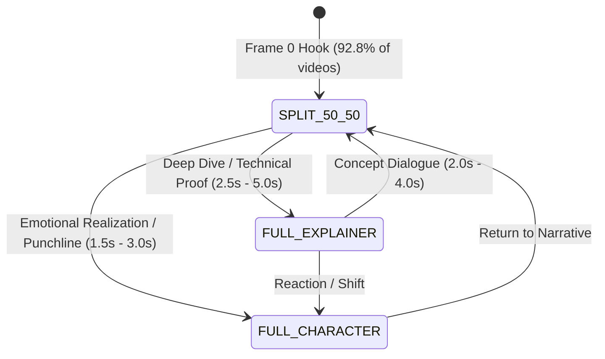

---
name: ultimate-motion-graphics
description: Production-grade programmatic motion graphics, Remotion, GSAP, Manim, and Google Flow (Veo 3.1) generative AI video editing engine. Enforces 3-state layout switching, 12 animation principles in code, kinetic typography, spring physics, and multi-track audio grammar.
version: 2.0.0
tags: [motion-graphics, remotion, gsap, manim, google-flow, veo-3.1, vox-style, video-editing, kinetic-typography]
---

# 🎬 Ultimate AI Motion Graphics & Video Editing Skill Suite

A unified, production-ready specification for AI coding agents to generate broadcast-grade programmatic animations, hybrid generative AI explainer videos, kinetic typography, and multi-track video compositions.

---

## 🏛️ 1. Core Architecture & Reference Foundation

Synthesizes best practices from 12 open-source motion graphics repositories:
- **Remotion Core**: React-based composition graph, frame-deterministic rendering, spring physics transitions (`@remotion/transitions`).
- **GSAP & WAAPI**: High-performance SVG morphs, SplitText stagger reveals, and ScrollTrigger physics.
- **Manim Engine**: Python-based mathematical/geometric animation, LaTeX equation transforms, and camera matrix zooms.
- **Google Flow / Veo 3.1 Bridge**: Generative 3D paper collage dioramas, stop-motion lighting, and tactile currency/chart models.
- **Viral Audio Grammar**: 4-layer audio hierarchy (Dialogue -14 LUFS, Ambient Bed -24dB, J-cut SFX 0.15s prior to visual cut, Chimes).

---

## 📊 2. The 3-State Visual Funnel State Machine

Short-form viral explainers (Vox / Varun Mayya style) strictly follow this 3-state state machine:



### Layout Distribution Rules:
| Layout State | Geometry | Video % | Target Duration | Trigger Context |
|---|---|:---:|:---:|---|
| **`SPLIT_50_50`** | **Top 50% (`1080x960`)**: Flow 3D Clip / Motion Card<br>**Bottom 50% (`1080x960`)**: Presenter Crop | **45% – 60%** | 2.5s – 4.5s | Default for Hook (0–6s), continuous dual-channel engagement. |
| **`FULL_EXPLAINER`** | **100% Screen (`1080x1920`)**: Full 3D AI Video, Code Terminal, or Diagram | **30% – 45%** | 2.0s – 5.0s | Critical technical proof, dramatic 3D charts, or mechanical demos. |
| **`FULL_CHARACTER`** | **100% Screen (`1080x1920`)**: Presenter with 1.15x Punch-in Zoom | **10% – 15%** | 1.5s – 3.0s | Rhetorical questions, punchlines, core takeaways, and CTA. |

---

## 📐 3. Motion Design Tokens & Physics Constants

### A. Spring Physics Presets (Remotion / Framer Motion / GSAP):
```typescript
export const MOTION_SPRINGS = {
  // Snappy pop-in for badges, pills, icons
  snappy: { mass: 0.5, damping: 12, stiffness: 180 },
  // Heavy tactile drop for paper cards, gold ingots
  heavy: { mass: 1.8, damping: 24, stiffness: 120 },
  // Smooth floating glide for charts, tickers
  glide: { mass: 1.0, damping: 18, stiffness: 90 },
  // Bouncy impact for checks, alert icons
  bounce: { mass: 0.8, damping: 8, stiffness: 150 },
};
```

### B. Cubic Bezier Curves:
- **`ease-out-expo`**: `cubic-bezier(0.16, 1, 0.3, 1)` (High-speed snap entry with long tail)
- **`circ-out`**: `cubic-bezier(0, 0.55, 0.45, 1)` (Immediate visual momentum)
- **`paper-tear-friction`**: `cubic-bezier(0.25, 0.1, 0.25, 1.0)`

### C. Color Palettes:
- **Editorial Paper (Vox)**: Cream Base `#F6F4EE`, Grid Lines `#E2DED4`, Charcoal `#1A1D20`, Highlight Gold `#FFD700`.
- **Trading Dark Glass (Profit Bricks)**: Obsidian `#10141C`, Gold Monogram `#FFD700`, Emerald Green `#00C853`, Text White `#FFFFFF`.

---

## 🤖 4. Generative AI Video Strategy (Google Flow / Veo 3.1)

1. **Prompting Formula for Vox Paper Collage Diorama**:
   `"Authentic Vox style paper collage diorama, [SUBJECT / MECHANIC], split lighting, warm directional studio light rays, tactile corrugated cardboard box, aged newsprint textures, 60fps, 8k"`
2. **Never Make Procedural PIL Motion Graphics**:
   Always generate true 3D visual assets via Google Flow (`GEM_PIX_2` -> `veo_3_1_i2v_s_fast_portrait`) or compile high-fidelity SVG/Canvas animations with spring physics.
3. **Mandatory Generation Halt Directive**:
   If any error or blockage occurs during AI clip generation, immediately **HALT** and report to the user. Never silently downgrade to cheap static image fallbacks.

---

## 💻 5. Production Code Templates

### A. Remotion React Multi-Layout Master Template:
```tsx
import React from "react";
import { AbsoluteFill, OffthreadVideo, staticFile, spring, useCurrentFrame, useVideoConfig } from "remotion";

export const MultiLayoutComposition: React.FC<{
  presenterSrc: string;
  flowClipSrc: string;
  layout: "SPLIT_50_50" | "FULL_EXPLAINER" | "FULL_CHARACTER";
}> = ({ presenterSrc, flowClipSrc, layout }) => {
  const frame = useCurrentFrame();
  const { fps } = useVideoConfig();

  const entrance = spring({ frame, fps, config: { mass: 0.8, damping: 14, stiffness: 120 } });

  if (layout === "FULL_EXPLAINER") {
    return (
      <AbsoluteFill style={{ backgroundColor: "#10141C" }}>
        <OffthreadVideo src={flowClipSrc} style={{ width: 1080, height: 1920, objectFit: "cover" }} />
      </AbsoluteFill>
    );
  }

  if (layout === "FULL_CHARACTER") {
    return (
      <AbsoluteFill style={{ backgroundColor: "#10141C" }}>
        <OffthreadVideo src={presenterSrc} style={{ width: 1080, height: 1920, objectFit: "cover", transform: "scale(1.12)" }} />
      </AbsoluteFill>
    );
  }

  // Default SPLIT_50_50
  return (
    <AbsoluteFill style={{ backgroundColor: "#10141C" }}>
      {/* Top Half: 3D AI Explainer Clip */}
      <div style={{ position: "absolute", top: 0, left: 0, width: 1080, height: 960, overflow: "hidden" }}>
        <OffthreadVideo src={flowClipSrc} style={{ width: 1080, height: 960, objectFit: "cover" }} />
      </div>

      {/* Gold Divider Line */}
      <div style={{ position: "absolute", top: 956, left: 0, width: 1080, height: 8, backgroundColor: "#FFD700" }} />

      {/* Bottom Half: Presenter with Clean Headroom */}
      <div style={{ position: "absolute", top: 960, left: 0, width: 1080, height: 960, overflow: "hidden" }}>
        <OffthreadVideo src={presenterSrc} style={{ width: 1080, height: 1920, objectFit: "cover", marginTop: -240 }} />
      </div>
    </AbsoluteFill>
  );
};
```

---

## 🛡️ 6. Quality Assurance & Self-Correction Checklist

- [ ] **0-Second Rule**: Video starts with `SPLIT_50_50` combining face + concept visual.
- [ ] **Zero Head Clipping**: Presenter crop in bottom split has minimum 80px headroom above hair.
- [ ] **Safe Subtitle Margin**: Subtitles strictly placed at `y=1750–1825` inside a dark backing pill (`#10141CE0`).
- [ ] **Dual-Tone Subtitle Palette**: Yellow (`#FFD700`) + White (`#FFFFFF`) with 5px black stroke.
- [ ] **No Procedural PIL Animations**: All explainer beats powered by Google Flow Veo 3.1 clips or high-fidelity Remotion/GSAP components.
- [ ] **Audio Broadcast Standard**: EBU R128 `-14 LUFS`, Peak `-1.5 dBFS`.
