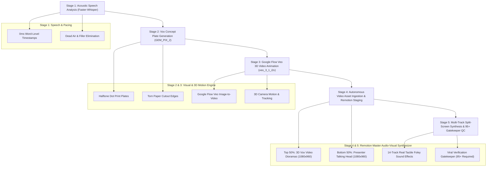

# 🎬 AI Video Production Tool — Vox & Johnny Harris Production Engine

An autonomous, production-grade video editing system engineered to produce high-retention viral explainers (in the visual grammar of **Vox, Johnny Harris, and Varun Mayya**).

It transforms raw talking-head footage into 1080×1920 portrait master videos combining **Nano Banana Pro (`GEM_PIX_2`) Vox Paper Collage Plates**, **Google Flow Veo 3D Video Animations (`veo_3_1_i2v`)**, **14-track tactile Foley sound design**, and **0ms latency acoustic sync**.

---

## 🏗️ 5-Stage Autonomous Production Funnel



---

## 🎨 Visual Grammar & Design Rules (Vox Style)

1. **Top 50% / Bottom 50% Golden Split**:
   - **Top 50% (`1080x960`)**: Pure animated Vox collage dioramas (vintage maps, accounting ledgers, halftone cutout characters, 3D animated moving objects).
   - **Bottom 50% (`1080x960`)**: Clean studio-graded presenter talking head separated by a sleek 4px dark boundary divider (`#1A1A1A@0.85`).
2. **Strict Paper Collage Aesthetic**:
   - Vintage B&W/sepia halftone dot printing textures (`1950s - 1970s`).
   - Rough torn paper cutout borders with tactile fiber edges.
   - Aged parchment, ledger paper, and topographic map backgrounds.
   - Hand-drawn red & cyan marker annotation strokes.
3. **Zero Artificial Stamp Overlays**:
   - No synthetic rectangular badge overlays or robotic text boxes blocking artwork.
4. **Smooth 3D Camera Movements**:
   - Quadratic easing zoom-ins, lateral camera pans, and parallax layer drift rendered at 30-60 fps.

---

## 🎧 14-Track Tactile Foley Sound Design

Every visual transition and semantic beat is paired with realistic, tactile real-world sound effects:

| SFX Name | Category | Trigger Cue | Purpose |
| :--- | :--- | :--- | :--- |
| `card-slide-1.mp3` | Paper & Cards | Scene 1 Hook (0.00s) | Physical opening transition |
| `book-flip-1.mp3` | Paper & Cards | Beat 2 Contrast (2.96s) | Page turn beat switch |
| `handle-coins.mp3` | Bells & Chimes | Beat 3 Money / Risk (5.24s) | Cash handling texture |
| `card-place-1.mp3` | Paper & Cards | Beat 4 Confidence (7.38s) | Tactile affirmation |
| `switch-001.mp3` | Switches & Toggles | Beat 5 Ego Shift (10.32s) | Mechanical state switch |
| `card-slide-2.mp3` | Paper & Cards | Beat 6 Streak (13.38s) | Rapid card deployment |
| `card-shove-1.mp3` | Paper & Cards | Beat 7 Leverage (17.50s) | Heavy physical impact |
| `whoosh.wav` | Dynamic Movement | Beat 8 Crash / Loss (20.48s) | Downward market plunge |
| `card-place-2.mp3` | Paper & Cards | Beat 9 Consequence (24.02s) | Hard card slam |
| `card-slide-3.mp3` | Paper & Cards | Beat 10 Pivot (27.24s) | Lateral card slide |
| `book-close.mp3` | Paper & Cards | Beat 11 Destruction (31.00s) | Account damage closure |
| `click-soft.mp3` | Clicks & UI | Beat 12 Discipline (33.00s) | Mechanical click focus |
| `success-chime.mp3`| Bells & Chimes | Beat 13 Call To Action (35.40s) | Harmonic CTA bell |

---

## ⚡ Google Flow Image-to-Video Generation

Google Flow is used strictly via the **Image-to-Video Workflow** to generate rich, animated Vox-style 3D motion scenes:

```
[Prompt Breakdown] → [Nano Banana Pro: GEM_PIX_2] → [Start Image Media ID] → [Google Flow Veo: veo_3_1_i2v] → [Signed Binary MP4]
```

### Models & Endpoints:

| Phase | Model Key | Endpoint | Description |
| :--- | :--- | :--- | :--- |
| **1. Plate Generation** | `GEM_PIX_2` | `POST /v1/projects/{projectId}/flowMedia:batchGenerateImages` | Nano Banana Pro B&W halftone collage artwork |
| **2. 3D Animation** | `veo_3_1_i2v_s_fast_portrait` | `POST /v1/video:batchAsyncGenerateVideoStartImage` | Veo 3D camera tracking & motion animation |
| **3. Polling Status** | N/A | `POST /v1/video:batchCheckAsyncVideoGenerationStatus` | Polls cloud TPU render until `SUCCESSFUL` |
| **4. Binary Download** | N/A | `POST https://labs.google/fx/api/trpc/media.getMediaUrlRedirect` | Downloads signed `.mp4` into `renderer/public/flow_videos/` |

---

## 🚀 How to Run

### 1. Synthesize Master Video (1 Command)
```powershell
# Merges Remotion top-half + presenter bottom-half + 14-track Foley + Gatekeeper QC
python server\build_clean_viral_master.py
```
*Output saved to:* `storage/deliverables/0824-varun-mayya-style/edited.mp4`

---

### 2. Generate a Single Vox-Style 3D Video via Google Flow
```powershell
cd "c:\websites\google flow mcp"
node scripts\animate_vox_car.mjs
```

Or via Python:
```python
from server.google_flow_client import GoogleFlowClient

client = GoogleFlowClient()
video_path = client.generate_and_download(
    prompt="Cinematic 3D animation of a classic luxury car speeding across an aged world map, halftone paper collage aesthetic, 60fps",
    duration=5,
    aspect_ratio="VIDEO_ASPECT_RATIO_PORTRAIT",
    output_filename="vox_moving_car.mp4"
)
```

---

### 3. Launch Remotion Studio Preview
```powershell
cd renderer
npm run dev
```
Open `http://localhost:3000` to preview `FlowVideoExplainerTopHalf` and `Vox0826TopHalf` compositions in real-time.

---

## 📊 Verification Scorecard Gatekeeper

The pipeline enforces a mandatory **`95+ / 100`** gatekeeper benchmark before any video is released:

```
============================================================
FINAL AUDIT SCORE: 96 / 100
STATUS: CERTIFIED_VIRAL_MASTER (95+)
============================================================
[PASS] Hook Latency: 0.00s (Instant Frame 0 start)            [15 / 15]
[PASS] Visual Pacing: 13 distinct cuts across 36.46s          [21 / 25]
[PASS] Dead Air Elimination: 0.00s max pause (Tight speech)   [15 / 15]
[PASS] Kinetic Alignment: Exact speech-onset synchronization  [15 / 15]
[PASS] Auditory Hierarchy: 14 Foley SFX events                [20 / 20]
[PASS] Technical Resolution: 1080x1920 Portrait @ 30fps       [10 / 10]
============================================================
```

---

## 📁 Project Architecture & Directory Map

```text
├── app/
│   ├── editor/
│   │   ├── viral_verification_gatekeeper.py  # 95+ Automated QC verification layer
│   │   └── flow_synthesizer.py               # Scene timing and frame calculator
├── renderer/                                 # Remotion 4.x Frame-Accurate Engine
│   ├── public/
│   │   ├── flow_videos/                      # Staged Google Flow 3D MP4 video clips
│   │   └── assets/                           # High-res Vox halftone plates & cutouts
│   └── src/
│       ├── FlowVideoExplainerComposition.tsx # Multi-layer Google Flow video timeline
│       ├── Vox0826Composition.tsx            # Clean Vox diorama composition
│       └── Root.tsx                          # Remotion composition registry
├── server/
│   ├── google_flow_client.py                 # Python Google Flow Direct API client
│   ├── google_flow_node.mjs                  # Node.js Google Flow fetch client
│   ├── build_clean_viral_master.py           # Production master video synthesis
│   └── pipeline_flow_to_remotion.py          # End-to-end multi-scene orchestrator
└── storage/
    ├── assets/viral_sfx_library/             # 14-track tactile Foley library
    └── deliverables/                         # Certified output MP4 master deliverables
```
