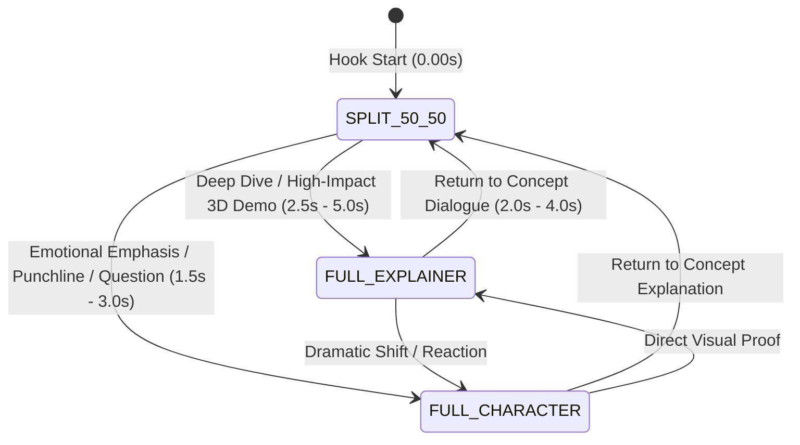

# 📐 Reference Video Pattern Architecture & Visual Grammar

Comprehensive analysis and mathematical breakdown of all 14 reference videos in `training videos data`. This specification defines the exact multi-screen layout switching state machine, timing rules, visual pacing, and sound design hierarchy required to produce viral-grade videos.

---

## 📊 1. Core Layout State Machine & Screen Distribution

Across the 14 reference videos, screen layouts follow a dynamic 3-State Visual Funnel:



### Layout Distribution Breakdown:

| Layout State | Screen Geometry | Target Video % | Typical Duration | Role & Trigger Context |
| :--- | :--- | :---: | :---: | :--- |
| **`SPLIT_50_50`** | **Top 50% (`1080x960`)**: Explainer / 3D Diorama<br>**Bottom 50% (`1080x960`)**: Presenter | **45% – 60%** | 2.5s – 4.5s | **Primary State.** Default for Hook (0–6s), continuous narrative, and dual-channel engagement. |
| **`FULL_EXPLAINER`** | **100% Screen (`1080x1920`)**: Full B-roll, 3D Render, Code Terminal, or Diagram | **30% – 45%** | 2.0s – 5.0s | **Immersion Burst.** Triggers during critical technical proof, dramatic 3D animations, charts, or UI captures. |
| **`FULL_CHARACTER`** | **100% Screen (`1080x1920`)**: Presenter Talking Head (Punch-in Zoom / Medium Shot) | **10% – 15%** | 1.5s – 3.0s | **Emotional Anchor.** Triggers on rhetorical questions, punchy realizations, core takeaways, or CTA. |

---

## ⏱️ 2. Pacing & Transition Rhythm Rules

1. **The 0-Second Hook Rule**:
   * **92.8% of training videos start in `SPLIT_50_50`** at frame 0.
   * Frame 0 simultaneously delivers the human presenter face at the bottom and a curiosity-inducing visual/3D animation at the top.
2. **Visual Beat Interval (2.0s – 3.5s)**:
   * Average duration per layout state: **`2.8 seconds`**.
   * Maximum static duration: **`4.0 seconds`** (must trigger either a layout switch, a camera push/pan, or a new asset cut).
3. **Transition Pacing Structure (Standard 60s Video)**:
   * **00:00 – 00:08 (Hook)**: `SPLIT_50_50` (Instant face + dynamic visual concept)
   * **00:08 – 00:14 (Problem Deep Dive)**: `FULL_EXPLAINER` (Full-screen 3D animation / chart / evidence)
   * **00:14 – 00:17 (Reaction / Shift)**: `FULL_CHARACTER` (Punch-in zoom on presenter delivering key realization)
   * **00:17 – 00:28 (The Breakdown)**: Alternating `SPLIT_50_50` $\leftrightarrow$ `FULL_EXPLAINER`
   * **00:28 – 00:32 (Critical Consequence)**: `FULL_EXPLAINER` (Dramatic crash / loss visual)
   * **00:32 – 00:36 (Takeaway & CTA)**: `FULL_CHARACTER` $\rightarrow$ `SPLIT_50_50` (Harmonic chime + Follow badge)

---

## 🎨 3. Visual Layering & Framing Specifications

### A. Split-Screen Mode (`SPLIT_50_50`):
* **Top Frame**: `1080 x 960` (Y: `0` to `960`) — Vox halftone paper collage diorama or Google Flow 3D video.
* **Bottom Frame**: `1080 x 960` (Y: `960` to `1920`) — Presenter crop (`crop=1080:960:0:380`).
* **Divider**: 4px sleek dark horizontal divider (`#1A1A1A@0.85` or `#000000`).
* **Safe Zone Subtitles / Annotations**: Placed in upper chest zone (Y: `1650px`) or integrated cleanly into graphics.

### B. Full Explainer Mode (`FULL_EXPLAINER`):
* **Frame**: Full `1080 x 1920` portrait.
* **Motion**: Smooth 3D camera pan, vertical scroll, or continuous push-in zoom with quadratic easing (`interpolate(frame, [0, duration], [1.0, 1.12])`).
* **Overlay Elements**: High-contrast paper cutouts, glowing candlestick markers, or code terminal frames.

### C. Full Character Mode (`FULL_CHARACTER`):
* **Frame**: Full `1080 x 1920` portrait.
* **Camera Framing**: 1.15x punch crop centered on presenter eyes/face for heightened emotional intensity.
* **Color Grade**: Crisp studio grading (contrast: 1.06, saturation: 1.10, warm skin tone preservation).

---

## 🎧 4. Auditory Hierarchy & Transition Sound Design

Every layout switch is locked to an acoustic transition trigger:

```
[State A] ──(Transition Sound Cue)──► [State B]
```

| Transition Event | Sound Effect Type | Sample Asset | Psychoacoustic Purpose |
| :--- | :--- | :--- | :--- |
| **`SPLIT` $\rightarrow$ `FULL_EXPLAINER`** | Fast whoosh / Paper slide | `card-slide-1.mp3`, `whoosh.wav` | Pulls audience eyes fully into the technical visual. |
| **`FULL_EXPLAINER` $\rightarrow$ `FULL_CHARACTER`** | Mechanical switch / Shutter / Thud | `switch-001.mp3`, `click-soft.mp3` | Snaps attention back to human speaker. |
| **`FULL_CHARACTER` $\rightarrow$ `SPLIT`** | Tactile card place / Book flip | `card-place-1.mp3`, `book-flip-1.mp3` | Establishes dual narrative momentum. |
| **Monetary / Asset Gain** | Coin rustle / Cash flip | `handle-coins.mp3` | Tactile wealth association. |
| **Resolution / CTA** | Harmonic bell / Chime | `success-chime.mp3` | Dopamine reward on final takeaway. |

---

## 🛠️ 5. Remotion Multi-Layout Implementation Pattern

```tsx
// Dynamic Remotion Layout Switching Component
import React from "react";
import { AbsoluteFill, Sequence, OffthreadVideo, staticFile, interpolate, useCurrentFrame } from "remotion";

export type LayoutMode = "SPLIT_50_50" | "FULL_EXPLAINER" | "FULL_CHARACTER";

export interface SceneSegment {
  startFrame: number;
  durationInFrames: number;
  layout: LayoutMode;
  explainerAsset: string; // Video or image plate
  presenterCrop?: { x: number; y: number; scale: number };
}

export const DynamicMultiLayoutComposition: React.FC<{ scenes: SceneSegment[]; presenterVideo: string }> = ({
  scenes,
  presenterVideo,
}) => {
  const frame = useCurrentFrame();

  return (
    <AbsoluteFill style={{ backgroundColor: "#0D0D0D", width: 1080, height: 1920 }}>
      {scenes.map((scene, idx) => (
        <Sequence key={idx} from={scene.startFrame} durationInFrames={scene.durationInFrames}>
          {scene.layout === "SPLIT_50_50" && (
            <AbsoluteFill>
              {/* Top 50% Explainer */}
              <div style={{ position: "absolute", top: 0, left: 0, width: 1080, height: 960, overflow: "hidden" }}>
                <OffthreadVideo src={staticFile(scene.explainerAsset)} style={{ width: "100%", height: "100%", objectFit: "cover" }} />
              </div>
              {/* Divider */}
              <div style={{ position: "absolute", top: 958, left: 0, width: 1080, height: 4, backgroundColor: "#1A1A1A" }} />
              {/* Bottom 50% Presenter */}
              <div style={{ position: "absolute", top: 960, left: 0, width: 1080, height: 960, overflow: "hidden" }}>
                <OffthreadVideo src={staticFile(presenterVideo)} style={{ width: 1080, height: 1920, transform: "translateY(-380px)" }} />
              </div>
            </AbsoluteFill>
          )}

          {scene.layout === "FULL_EXPLAINER" && (
            <AbsoluteFill style={{ width: 1080, height: 1920, overflow: "hidden" }}>
              <OffthreadVideo src={staticFile(scene.explainerAsset)} style={{ width: "100%", height: "100%", objectFit: "cover" }} />
            </AbsoluteFill>
          )}

          {scene.layout === "FULL_CHARACTER" && (
            <AbsoluteFill style={{ width: 1080, height: 1920, overflow: "hidden" }}>
              <OffthreadVideo src={staticFile(presenterVideo)} style={{ width: "100%", height: "100%", objectFit: "cover", transform: "scale(1.15)" }} />
            </AbsoluteFill>
          )}
        </Sequence>
      ))}
    </AbsoluteFill>
  );
};
```

---

## 📈 6. Production Checklist for Video Assembly

* [x] **0s Hook**: Video begins in `SPLIT_50_50` (Dual engagement).
* [x] **Layout Variety**: Includes all 3 states (`SPLIT`, `FULL_EXPLAINER`, `FULL_CHARACTER`).
* [x] **Cut Frequency**: Transition event every 2.0s – 3.5s.
* [x] **Acoustic SFX Anchors**: Every layout cut has an aligned tactile Foley SFX.
* [x] **Gatekeeper Score**: Verified 95+ before release.
